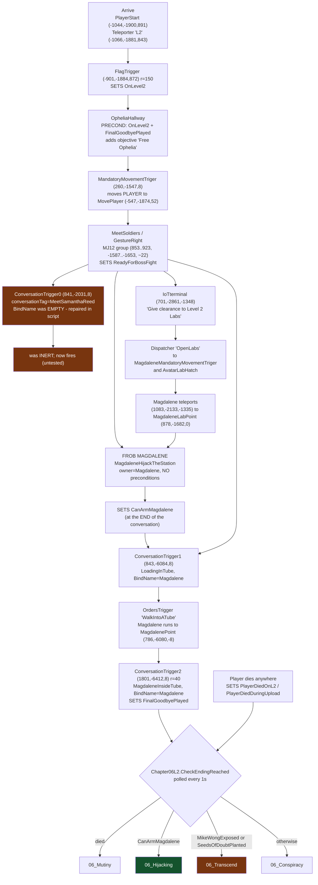

# L2 Walkthrough Map — 06_OpheliaL2

A Detroit-style flow graph for L2: every player move, action, conversation and flag on the
way to each of the four endings.

**How this was produced.** Every coordinate, property, flag direction and owner below was
read out of the shipped binaries — `L2_export.t3d` for actors, `tools/con_dump.js --records
--flagmap` for conversation logic, and `CNN/Classes/Chapter06L2.uc` for the ending
decision. Nothing here is recalled or inferred from play.

**Confidence legend.** Read these markers literally; they are the point of the document.

| Marker | Meaning |
|---|---|
| OK | Measured from the binaries. Exact. |
| INF | Inferred from how the engine works, not directly observed in play. |
| DEAD | **Verified broken** — cannot happen in the shipped build. |
| UNK | Not knowable from the data. Do not trust, do not invent. |

> **The one thing this map does not contain: navigation.** Which door, ladder, keypad or
> corridor connects one coordinate to the next was never measured and is *not* recorded
> here. Coordinates are exact; the path between them is UNK. If you need the route, fly it
> once with `ghost` and write it down — do not guess from the numbers.
>
> **You usually don't need the route.** `CNNGoto <landmark>` (section 1) teleports straight
> to any node in this document, which is what makes the coordinates useful without the
> paths. The route only matters when you are testing the level *as a player would walk it*.

---

## 1. Launching and instrumenting a run

```
cnn package && cnn install     # never skip: the stale distribution CNN.u shadows a rebuild
cnn test                       # New Game, then console: open 06_OpheliaL2
```

Console key is **T** (or **~**). Both are bound by the generated `CNNUser.ini` only when
the player has nothing bound — see `tools/generate_cnn_ini.ps1`.

**Enabling cheats.** The player class is `CNN.TantalusDenton`, not `DeusExPlayer`, so the
class must be named explicitly:

```
set cnn.tantalusdenton bcheatsenabled true
```

Without that, `EditFlags` and `Legend` return early and do nothing. `CNNTestEnding` is an
exec function and needs no cheats. Useful once cheats are on: `ghost`, `allammo`,
`EditFlags` (read/write any flag live).

**Getting around — `CNNGoto`.** An exec on `TantalusDenton`, no cheats needed. Teleports to
any landmark in this document, which is how the coordinates here become usable without
knowing the routes:

```
CNNGoto magdalene
```

`start` `sam` `samantha` `magdalene` `maglab` `soldiers` `battle` `iot` `wong` `meph` `jc`
`tube` `final` `wall` —
run it with no argument to print the list. The landmarks are actor origins, so it lifts
you clear of the floor before placing you; if every offset is refused it means you are not
on 06_OpheliaL2. Each jump is logged.

`CNNGoto` also brings Magdalene with you when she is `Following` — vanilla
`StartConversationByName` refuses outright beyond **800 units** from the conversation's
owner (`if ((dist <= 800) || (bForcePlay))`), so leaving her behind silently kills every
scene she owns.

**Firing scripted beats — `CNNFire <tag>`.** Triggers any tagged actor the way a Dispatcher
would. Several L2 beats are dispatcher-fired rather than walked into:

```
CNNFire MiniGameDispatcher
```

| Tag | Effect |
|---|---|
| `MiniGameDispatcher` | the tube sequence → `FinalGoodbyePlayed` → an ending |
| `CommCenterDispatcher` | doors + alliances + orders for the comm centre battle |
| `OpenLabs` | lab clearance; also teleports Magdalene up |
| `LabEndingSuccessDispatcher` | `ShakeTriggerS` + `CNNMoverTube` |

**Diagnosing a spot — `CNNWhere` / `CNNProbe`.** `CNNWhere` logs exact position, yaw and
zone. `CNNProbe` traces forward and reports whether what is in front of you is an **Actor**
(fixable from script) or **world BSP** (needs UnrealEd), with hit location and surface
normal. It fires both a zero-extent ray and a player-sized box, because they disagree
usefully — see §7b.

**Reading flags during a run.** `Chapter06L2` polls 22 flags every second and logs each
change (`bLogFlagChanges`, on by default). `CNNGoto`, `CNNFire`, `CNNWhere` and `CNNProbe`
all log too, so the run reads back as a session transcript:

```
cnn log "CNN L2"
```

Kentie's exe writes the log into the OneDrive-localised Documents folder, not `System\`;
`cnn log` finds it either way. `ClientMessage` output never reaches the log — only `Log()`
does, which is why the teleports are logged separately from what you see on the HUD.

**Toggling cheats.** `exec cheaton` / `exec cheatoff` (files in the game `System\` dir,
not tracked in the repo). The extension is arbitrary — `cheaton` and `cheaton.txt` both
work. Needed for `Legend`, `EditFlags` and `ghost`; not for `CNNGoto` or `CNNTestEnding`.

---

## 2. Geography

The level runs roughly **north to south** (Y decreasing) across three vertical bands.

| Band | Z | Contents |
|---|---|---|
| Entry ledge | ~+870 | Arrival, `OnLevel2` trigger |
| Main deck | ~0 to +25 | MJ12 soldiers, Samantha Reed trigger, corridor south, tube area |
| Lower labs | ~-890 to -1350 | Magdalene's start, JC Avatar, IoT terminal, Mephistopheles, the Reed/Wong scene |

Anything at **positive Y** (e.g. `MikeWong1` at `(962, 3863, 268)`, `SamanthaReed` #2 at
`(944, 3788, 256)`, `BobPage2` at `(5835, -2160, 80)`) is an **offstage set** — holo and
cutscene doubles, not places the player walks. INF

---

## 3. The flow graph



---

## 4. Node reference

### Spine — every run passes through these

| # | Node | Position | Effect | Conf |
|---|---|---|---|---|
| 1 | `PlayerStart` | `(-1044, -1900, 891)` | New-game / EXEC spawn | OK |
| 1b | `Teleporter` tag `L2` | `(-1066, -1881, 843)` | Arrival point from L1 | OK |
| 2 | `FlagTrigger` | `(-901, -1884, 872)` r=150 | **SETS `OnLevel2`** | OK |
| 3 | `OpheliaHallway` | owner `OpheliaUI` | PRECOND on `OnLevel2` + `FinalGoodbyePlayed`; adds "Free Ophelia" | OK |
| 4 | `MandatoryMovementTriger` | `(260, -1547, 8)` | Moves **the player** to `MovePlayer (-547,-1874,52)` | OK |
| 5 | MJ12 group | `(853..923, -1587..-1653, ~22)` | `MeetSoldiers`; `GestureRight` **SETS `ReadyForBossFight`** so avatars turn hostile | OK |
| 6 | `LoadingInTube` | `(843, -6084, 8)` | Starts upload scene; fires `WalkIntoATube` | OK |
| 7 | `MagdaleneInsideTube` | `(1801, -6412, 8)` r=40 | **SETS `FinalGoodbyePlayed`** — the ending gate. **Dispatcher-fired**, not walked into: `MiniGameDispatcher (1801,-6353,8)` triggers it. Its coordinates are OUTSIDE walkable space — teleporting there puts you in the void; use `CNNFire MiniGameDispatcher`. | OK |

Node 2 sits ~145 units from the spawn with a 150 radius, so `OnLevel2` is set on your
first steps. `FlagTrigger` defaults (`bSetFlag=True`, `flagValue=True`, `flagExpiration=-1`,
`bTriggerOnceOnly=True`) make it permanent. OK

### The Hijacking branch

| # | Node | Position | Effect | Conf |
|---|---|---|---|---|
| H1 | **Magdalene** | `(1083, -2133, -1335)` | `Tag=HiddenMagdalene`, `Orders=Standing`, CoilGun, `Alliance=Player`, `bInvincible` — friendly and frobbable from level start | OK |
| H2 | `IoTterminal` | `(701, -2861, -1348)` | Option "Give clearance to Level 2 Labs" fires event `OpenLabs` | OK |
| H3 | `Dispatcher OpenLabs` | `(-97, -2536, -1338)` | to `MagdaleneMandatoryMovementTriger`, `AvatarLabHatch` | OK |
| H4 | `MagdaleneMandatoryMovementTriger` | `(-95, -2465, -890)` | `MT_MovePawn`, `MovedPawnTag=HiddenMagdalene`, teleports her to `MagdaleneLabPoint (878,-1682,0)` | OK |
| H5 | `MagdaleneLabOrdersTrigger` | `(-94, -2280, 8)` | `Orders=Following` | OK |
| H6 | **`MagdaleneHijackTheStation`** | owner Magdalene | **No flag preconditions.** **SETS `CanArmMagdalene`** at the *end* of the record (`@0x00644f`) | OK |

**Frobbing her at any stage should start it** (INF — the record has no gate). But the SET
is at the tail, so **breaking off early earns nothing**. OK

Her position depends on progress: start, then `OpenLabs` teleports her up near the entry,
then `Following`, then after `JCboss` she turns hostile to `BPAvatar` and fights, then
after `LoadingInTube` she runs to the tube. OK

### Where the rest of the cast actually is

The cast is placed as **generic pawns with `BindName` overrides**, not as named classes —
a search for `Class=SamanthaReed` finds nothing and is misleading. OK

| BindName | Class | Position |
|---|---|---|
| `SamanthaReed` | `Female2`, Sitting | `(971, -3991, -1284)` |
| `MikeWong` | `Male2` | `(782, -4058, -1301)` |
| `DrMephistopheles` | `Doctor`, tag `Mephistopheles` | `(866, -4480, -1233)` |
| `JCAvatar` | `BPAvatar` | `(894, -2315, -1303)` |
| `PageAvatar` | `LuciusDeBeers` | `(1279, -6067, 110)` |
| `OpheliaMedbot` | `MedicalBot` | `(1487, -6294, 4)` |
| `DrJohnson` | `DrJohnson`, Sitting | `(757, -4138, -1304)` |

Samantha Reed and Mike Wong are **in the lower labs at Y around -4000**, roughly 2000 units
south of and 1300 below the trigger that is supposed to introduce them.

---

## 5. Route per ending

| Ending | What the player does | Condition | Reachable |
|---|---|---|---|
| **Mutiny** (worst) | **Die anywhere on L2.** Judged immediately — never needs the tube. | `PlayerDiedOnL2` or `PlayerDiedDuringUpload` | yes |
| **Hijacking** (best) | Reach Magdalene, **play `MagdaleneHijackTheStation` to the end**, then reach the tube. | `CanArmMagdalene` | yes |
| **Conspiracy** | Walk the spine, talk to nobody, reach the tube. | none of the above (passive) | yes |
| **Transcend** | Walk the repaired `MeetSamanthaReed` trigger at `(841,-2031,8)`, reach the `ContinueOn` branch, then the tube. | `MikeWongExposed` or `SeedsOfDoubtPlanted` | repaired, **untested** |

Decision logic lives in `Chapter06L2.CheckEndingReached()`, polled once a second. Death
outranks everything; every other branch waits for `FinalGoodbyePlayed`.

---

## 6. Transcend — was unreachable in the shipped build; now repaired, still unverified

> **Status 2026-08-26.** Everything below describes the **shipped map**, and both faults
> are now repaired in script. A larger root cause was found afterwards — duplicate
> conversations in `Chapter06.con` shadowing L2's (§6c) — which blocked *every* ending, not
> just this one. **Hijacking is confirmed reachable in play; Transcend is not yet tested.**

Both of its conditions were dead, for different reasons.

**`MikeWongExposed`** is SET in exactly one place: the `ContinueOn` record (`@0x009eca`,
`ET_SetFlag`), part of the Samantha Reed scene. The only thing in the map that can start
that scene is `ConversationTrigger0` at `(841, -2031, 8)` — and it has **no `BindName`**.
Vanilla `ConversationTrigger.Touch()` reads:

```unrealscript
if ((BindName != "") && (conversationTag != ''))
```

With `BindName` empty the whole body is skipped, so the trigger is **inert**: it never
calls `StartConversationByName`. OK — and note the level's two working triggers both carry
`BindName="Magdalene"`.

**`SeedsOfDoubtPlanted`** is SET only in `AccuseofBluffing`, a branch under `SocialBoss`.
`SocialBoss` carries a PRECOND on `ReadyForSocialBoss`, which is SET only by `TalkToPage`,
and no trigger in the map starts `TalkToPage`. OK for the chain; UNK on whether some other
path reaches it.

### Fix — implemented 2026-08-26

`Chapter06L2.RepairSamanthaReedTrigger()`, called from `PrepareFirstFrame()`, walks
`AllActors(class'ConversationTrigger')` and fills in `BindName="SamanthaReed"` on the
trigger whose `conversationTag` is `MeetSamanthaReed`, but **only when `BindName` is
empty** — so if the map is ever fixed properly this becomes a no-op. Matching on
`conversationTag` rather than `Tag` because two of the three triggers share the generic
tag `ConversationTrigger`.

Doing it in script rather than UnrealEd keeps the change diffable, the same reason the
rest of L2's logic lives in source.

Confirmed running in-game — the log line appears at level load: OK

```
ScriptLog: CNN L2: repaired MeetSamanthaReed trigger (BindName was empty)
```

**Still unverified end-to-end:** that the conversation actually *plays* when the trigger is
touched. Samantha Reed is at `(971,-3991,-1284)`, roughly 2000 units south of and 1300
below the trigger at `(841,-2031,8)`, and Deus Ex needs its speakers present to run a
scene. UNK until someone walks it. If it fails, `Invoke Con` (section 8) will start the
conversation directly and tell you whether the scene itself works.

---

## 6b. The comm centre battle — Avatars never join it

Found from play 2026-08-26: the MJ12 troops and the Avatars ignore each other, while the
Avatars attack the player normally.

`Dispatcher21`, tag `CommCenterDispatcher`, at `(1240, -1990, -1338)`:

```
OutEvents(0)=OpenCommCenterDoors
OutEvents(1)=MJ12AllianceTrigger      MJ12Troops -> Avatars  = -1.0
OutEvents(2)=AvatarsAllianceTrigger   Avatars -> MJ12Troops  = -1.0
OutEvents(3)=MJ12OrdersTrigger        MJ12 run to the battle
OutEvents(4)=MJ12OrdersTrigger        <-- copy-paste slip
```

Slot 4 repeats slot 3. `AvatarsOrdersTrigger` sits at `(1240, -1848, -1338)` fully
configured — `Orders=RunningTo`, `ordersTag=CommCenterBattleSpawnPoint`,
`Event=AvatarsFightGroup` — and **nothing in the map references it**; its only appearance
in `L2_export.t3d` is its own `Tag=` line. OK

Both alliance triggers are correctly configured as a mutual pair, and `AllianceTrigger`
uses `Event` as a *selector* (`foreach AllActors(class'ScriptedPawn', P, Event)`), which
matches the pawn tags. So the hostility wiring reads correct; only the marching order was
missing.

**Fixed in script:** `Chapter06L2.RepairCommCenterBattle()` rewrites the duplicated slot to
`AvatarsOrdersTrigger`. It scans all 8 slots rather than assuming index 4, skips the
dispatcher entirely if `AvatarsOrdersTrigger` is already present, and keeps the first MJ12
order intact. Confirmed firing in-game: OK

```
ScriptLog: CNN L2: repaired CommCenterDispatcher OutEvents(4) MJ12OrdersTrigger -> AvatarsOrdersTrigger
```

**Still unconfirmed:** whether the two sides now actually fight. UNK. If they still ignore
each other, the next suspect is `bPermanent` — neither alliance trigger sets it, unlike
`MagdaleneHostileToJC` which does, and a non-permanent `ChangeAlly` can be overwritten.
The groups are already close (MJ12 at Y≈-1600, Avatars at Y≈-1790 to -2450, battle spawn at
`(874,-1850,-3)`), so hostility alone should be enough once they are ordered together.

---

## 6c. Root cause — duplicate conversations shadowing L2's (the big one)

Found 2026-08-26 after "the soldiers conversation ended and nothing happened".

**`Chapter06.con` holds duplicate copies of most L2 conversations** — same `conName`, same
owner BindName — and they **load before** `OpheliaL2.con`'s.
`StartConversationByName` walks the owner's `conListItems` and takes the **first** name
match, so the stale copy always won. The scene played perfectly and **set nothing**.

Confirmed live on this level before the fix:

```
MJ12Sergeant [0] MeetSoldiers                [1] MeetSoldiers
Magdalene    [1] MagdaleneHijackTheStation   [4] (again)
SamanthaReed [0] MeetSamanthaReed            [1] (again)
OpheliaUI    [0] OpheliaHallway              [2] (again)
```

Load order was established from `OpheliaHallway`: only OpheliaL2's copy carries the
`OnLevel2` precondition, and the live dump put that one at index `[2]`. So the **later**
duplicate is the level-specific one. OK

This single bug simultaneously blocked `ReadyForBossFight`, `CanArmMagdalene` **and**
`FinalGoodbyePlayed` — the ending gate itself. It is why nothing ever fired.

**Fixed** by `Chapter06L2.DedupeConversations()` (keep the last duplicate). Deleting them
from `Chapter06.con` is the real fix but needs ConEdit.

> Note: `Conversation.flagRefList` lists **preconditions**, not SET events — "(no flags)"
> in the dump means "no gate", not "sets nothing".

**Result:** first end-to-end ending through real gameplay —
`ReadyForBossFight` @11s → `CanArmMagdalene` @32s → `FinalGoodbyePlayed` @75s →
`Browse: 06_Hijacking`. OK

---

## 7. Flags — the complete L2 picture

Generated by `node tools/con_dump.js CNN/Conversations/OpheliaL2.con --flagmap`.

| Flag | Set by | Notes |
|---|---|---|
| `OnLevel2` | map `FlagTrigger` | PRECOND of `OpheliaHallway`; never set by any conversation |
| `ReadyForBossFight` | `GestureRight` | avatars turn hostile — designed, not a bug |
| `CanArmMagdalene` | `MagdaleneHijackTheStation` | **Hijacking** |
| `FinalGoodbyePlayed` | `MagdaleneInsideTube` | **the ending gate** |
| `MikeWongExposed` | `ContinueOn` | **Transcend** — unreachable, see section 6 |
| `SeedsOfDoubtPlanted` | `AccuseofBluffing` | **Transcend** — unreachable, see section 6 |
| `SamUnfriendly` | `mephcapt` | also CHECKed by `mephcapt`, `SamGivesQuest` |
| `WongParanoid` | `GiveUp` | |
| `ReadyForSocialBoss` | `TalkToPage` | PRECOND of `SocialBoss` |
| `HideJCHolo`, `HideMJ12TroopHolo`, `HideMeadHolo`, `HideUberAllesHolo` | `JCboss`, `CommCenterDispatcher`, `PhilipMeadHolo`, `UberAllesBriefing` | hologram staging |
| `AllObjectsDestroyed` | **the Docks**, `CNNDetonationTrigger.uc:37` | CHECK-only in L2 (by `SocialBoss`) — the one reason to enter L2 *through* L1 |
| `MetReedAndWong` | **nothing, anywhere** | PRECOND of `SamGivesQuest`. Searched all 6 `.con` files, all of `CNN/Classes/`, and the map. Polarity UNK — if it wants *true*, `SamGivesQuest` is dead |
| `IsArrivalPlayed`, `HideBobPageHolo` | — | declared, never referenced |

`PRECOND` polarity (wants true vs wants false) is **not recoverable** from the file format.
UNK. Treat it as "gated on this flag" and nothing more.

---

## 7b. Known issue — invisible wall in the south corridor (needs UnrealEd)

Measured 2026-08-26 with `CNNProbe`, which traces forward and reports whether the blocker
is an Actor or world BSP. Three probes at different X, all identical:

```
ray -> WORLD BSP  hitLoc=(769,  -5464, 15)  normal=(0,-1,0)
box -> WORLD BSP  hitLoc=(810,  -5525, 15)  normal=(0,-1,0)
ray -> WORLD BSP  hitLoc=(1095, -5464, 15)  normal=(0,-1,0)
box -> WORLD BSP  hitLoc=(1048, -5522, 15)  normal=(0,-1,0)
ray -> WORLD BSP  hitLoc=(1281, -5464, 15)  normal=(0,-1,0)
box -> WORLD BSP  hitLoc=(1250, -5528, 15)  normal=(0,-1,0)
```

| Property | Value | Conf |
|---|---|---|
| Blocker type | **World BSP** — no actor involved, so script cannot fix it | OK |
| Plane orientation | faces `-Y`, normal `(0,-1,0)` | OK |
| Visible wall | `Y = -5464` (where zero-extent rays land) | OK |
| Player stopped at | `Y ≈ -5525`, about **60 units short** of the visible wall | OK |
| Span | at least `X = 769 → 1281` (>500 units), at `Z ≈ 15` | OK |

The ray/box disagreement is the diagnosis: a zero-extent ray passes straight through and
hits the real wall at `Y=-5464`, while a player-sized box trace stops ~60 units earlier.
Something thin and **unrendered but solid** sits in front of the wall across that span.

**Fix requires UnrealEd** — rebuilding geometry in that corridor. Everything needed to find
it is above: select brushes near `Y ≈ -5500..-5525`, `X 769..1281`, `Z ≈ 15`.

Lead, **UNVERIFIED**: `Brush621` has `Location=(728, -5464, -32)`, matching the visible-wall
plane. Do NOT trust bounding-box reasoning on it — it carries
`Rotation=(Pitch=163840, Yaw=212992, Roll=32768)`, and a bbox query that ignored rotation
already produced one confidently wrong answer here.

**Ruled out** — do not re-investigate:

- `RenderExt` — it *did* cause the flat grey/blue wedges at this spot (stock
  `Render=Render.Render` draws the geometry correctly), but a renderer cannot create
  collision. The wall persists on both. Two separate faults; the project keeps RenderExt.
- Blocking actors — L2 contains no `BlockPlayer`/`BlockAll` class at all.
- Movers — `CNNProbe` returns the LevelInfo, not a mover, at every probe.
- Warp zones — nearest is >2000 units away.

Reproduce with `CNNGoto wall` (`918, -5686, 15`), walk south, then `CNNProbe`.

---

## 8. Fast path for testing

`CNNTestEnding hijack | transcend | conspiracy | mutiny` — an exec on `TantalusDenton`, no
cheats needed. It sets the accumulated-state flags for one ending; `CheckEndingReached()`
travels on the next tick (~1s).

It **bypasses reachability entirely**, which is why all four passed on 2026-08-16 while
Transcend was in fact unreachable in play. Use it to test the *endings*; use a real
playthrough plus `cnn log "CNN L2 flag"` to test the *routes*.

### The in-game debug menu — `Legend`

Deus Ex ships a developer menu. Console `Legend` (needs
`set cnn.tantalusdenton bcheatsenabled true` first) opens `BehindTheCurtain`:

| Button | What it does |
|---|---|
| **Edit Flags** | read and write any flag live — the interactive counterpart to `cnn log` |
| **Invoke Con** | pick an actor by `BindName`, see its conversations, see the flags each one references, and **start it directly** |
| **Load Map** | load any map from the MAPS directory |
| **Show Class** | display actors in the 3D scene |
| Add Dump / View Dumps | **teleport bookmarks**, not conversation dumps — the name collision is misleading |

**`Invoke Con` is the one to know for L2.** It lists conversations bound to actors that are
actually in the level, so it can start `MeetSamanthaReed` on demand — useful for testing
the Transcend scene independently of whether the repaired trigger fires.

**How it differs from `tools/con_dump.js`:** Invoke Con needs the game running with the
level loaded and cheats on, only sees conversations whose owner is present, and lists flag
*names* with no direction. `con_dump` reads the `.con` files offline, sees every record
including ones no live actor owns, labels each reference SET / CHECK / PRECOND / REF, and
its output can be diffed in git. Neither replaces the other — but note that Invoke Con
could not have found the inert trigger, because it inspects actor-bound conversations, not
triggers.
